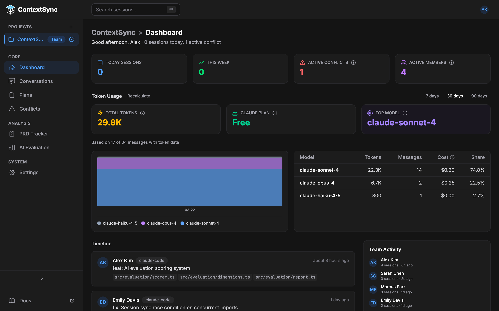
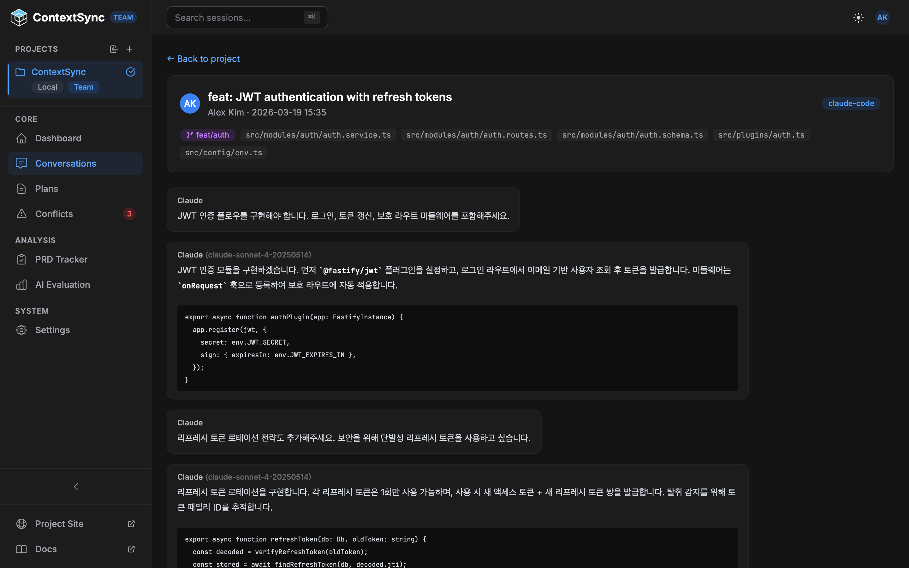
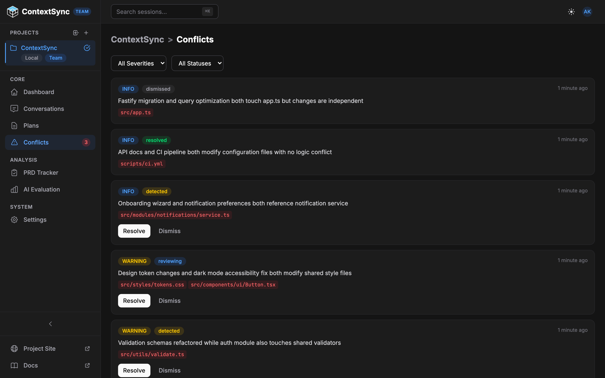
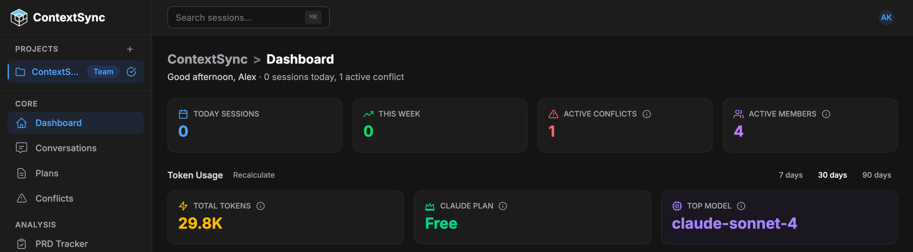
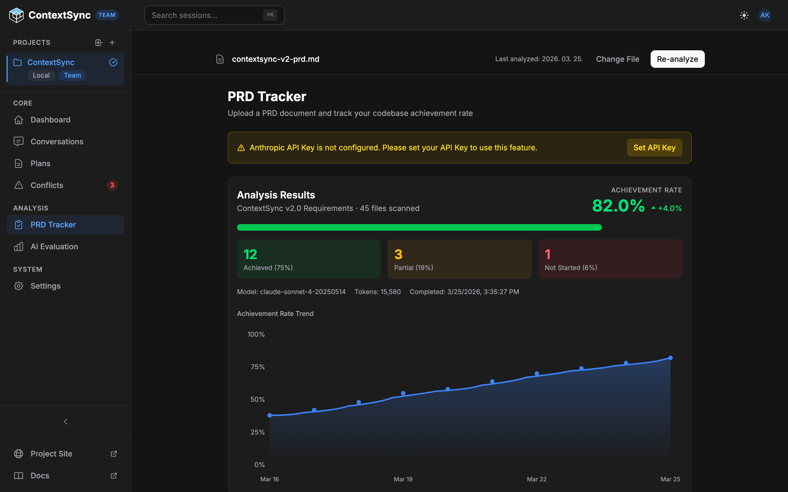
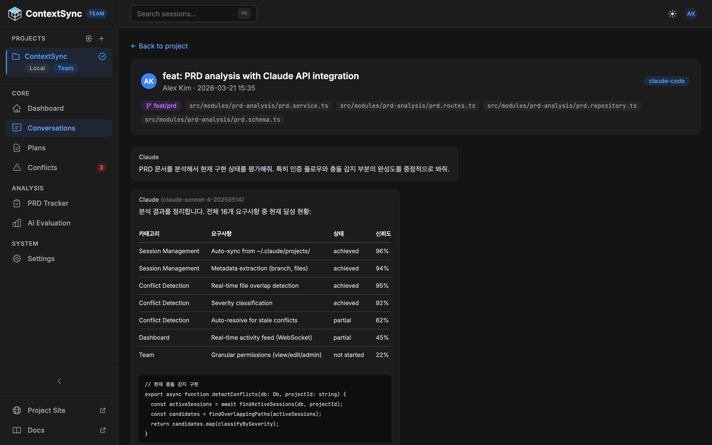
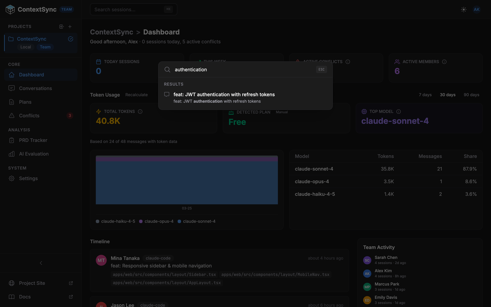
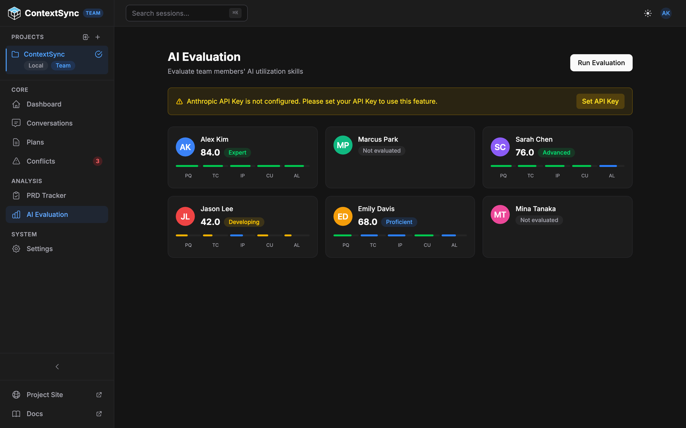
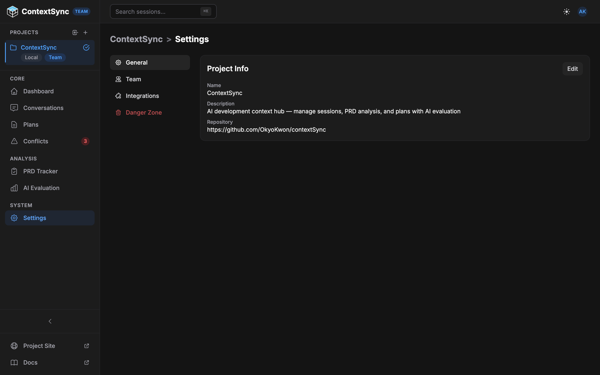

# ContextSync

[](https://github.com/OkyoKwon/contextSync/actions/workflows/ci.yml)
[](LICENSE)
[](https://www.typescriptlang.org/)
[](https://nodejs.org/)
[](https://pnpm.io/)

**[Project Site](https://okyokwon.github.io/contextSync/)**

**AI development context hub** — manage sessions, PRD analysis, and plans in one place with AI-powered evaluation — solo or with your team.

The problem developers and teams face with Claude Code: sessions are scattered across local machines, past context gets lost, and PRDs and plans live separately from code. ContextSync unifies sessions, PRD analysis, and plans in one place, preserving development context with AI evaluation and conflict detection.

<p align="center">
  
</p>

---

## Table of Contents

- [Key Features](#key-features)
- [Getting Started](#getting-started)
- [Deployment Modes](#deployment-modes)
- [Tech Stack](#tech-stack)
- [Project Structure](#project-structure)
- [Scripts](#scripts)
- [Roadmap](#roadmap)
- [Contributing](#contributing)
- [Community](#community)
- [Acknowledgements](#acknowledgements)
- [License](#license)

---

## Key Features

### Session Archive & Sync

Automatically scans local Claude Code sessions (`~/.claude/projects/`) and syncs them to the web dashboard. Active sessions are shown by default, grouped by project.



### Conflict Detection

Detects when multiple team members modify the same files simultaneously and classifies conflicts by severity.



### Dashboard & Analytics

Real-time timeline and stats showing your entire team's AI activity at a glance — session counts, token usage charts, hot files, and weekly trends.



### PRD Analysis

Upload PRD documents and let Claude analyze requirement fulfillment across your sessions. Track per-requirement status and overall scores.



### Plans

Create structured markdown plans and link them to projects for organized development workflows.



### Full-text Search

PostgreSQL tsvector-based search across session titles, message content, file paths, and tags.



### AI Evaluation

Score team members' AI utilization across sessions with multi-dimensional analysis and evidence tracking.



### Team Collaboration

Role-based access control (Owner / Member). Invite teammates and share projects with simple permissions.



---

## Getting Started

### Prerequisites

- **Homebrew** — macOS package manager
- **Node.js 22+** — JavaScript runtime
- **pnpm** — package manager (enabled via Node.js built-in Corepack)
- **Docker** — for PostgreSQL container (not needed for team-member mode)

<details>
<summary>macOS one-command install</summary>

```bash
# 1. Homebrew (skip if already installed)
/bin/bash -c "$(curl -fsSL https://raw.githubusercontent.com/Homebrew/install/HEAD/install.sh)"

# 2. Node.js 22 + Docker Desktop
brew install node@22
brew install --cask docker

# 3. Enable pnpm
corepack enable
```

> After installing Docker Desktop, launch the app once to activate the `docker` CLI.

</details>

### Quick Setup (One Command)

```bash
git clone https://github.com/OkyoKwon/contextSync.git && cd contextSync
corepack enable           # Activates pnpm (one-time, requires Node.js 22+)
pnpm install
pnpm setup               # Installs deps, starts DB, migrates, seeds
pnpm dev
```

> `pnpm setup` runs the full bootstrap: Docker Compose up → DB migration → seed data.
> Or run `bash scripts/setup.sh` (without `--defaults`) for an interactive wizard with deployment mode selection.

Open `http://localhost:5173` and enter your name. API runs at `http://localhost:3001`.

### Manual Setup

<details>
<summary>Personal mode (default — solo, local DB)</summary>

```bash
pnpm install
docker compose up -d
cp apps/api/.env.example apps/api/.env    # JWT_SECRET has dev default
pnpm --filter @context-sync/api migrate
pnpm --filter @context-sync/api seed      # Optional: sample data
pnpm dev
```

</details>

<details>
<summary>Team Host (admin hosting shared DB)</summary>

```bash
pnpm install
# Place SSL certs in certs/ directory
docker compose --profile team-host up -d
cp apps/api/.env.example apps/api/.env
# Set DATABASE_SSL=true, REMOTE_DATABASE_URL for team sharing
pnpm --filter @context-sync/api migrate
pnpm dev
```

</details>

<details>
<summary>Team Member (connecting to remote DB)</summary>

```bash
pnpm install
pnpm setup:team    # Interactive: DB URL + name + Join Code
pnpm dev
```

No Docker required. Runs interactive setup that configures remote DB connection and joins the team project.

</details>

### Environment Variables

Only `DATABASE_URL` is required. All others have sensible defaults.

<details>
<summary>Full environment variable reference</summary>

| Variable                 | Required | Description                                                        |
| ------------------------ | -------- | ------------------------------------------------------------------ |
| `DATABASE_URL`           | Yes      | PostgreSQL connection string                                       |
| `JWT_SECRET`             | No       | JWT signing key (min 32 chars, dev default built-in)               |
| `JWT_EXPIRES_IN`         | No       | Token expiry (default: `7d`)                                       |
| `HOST`                   | No       | Server host (default: `0.0.0.0`)                                   |
| `NODE_ENV`               | No       | `development` (default), `production`, or `test`                   |
| `FRONTEND_URL`           | No       | Frontend URL (default: `http://localhost:5173`)                    |
| `ANTHROPIC_API_KEY`      | No       | For PRD analysis feature                                           |
| `ANTHROPIC_MODEL`        | No       | Claude model ID (default: `claude-sonnet-4-20250514`)              |
| `SLACK_WEBHOOK_URL`      | No       | Slack notification webhook                                         |
| `DATABASE_SSL`           | No       | Enable SSL for DB connection (default: `false`)                    |
| `DATABASE_SSL_CA`        | No       | Path to CA certificate for self-signed certs                       |
| `RUN_MIGRATIONS`         | No       | Auto-run migrations (default: `true`, set `false` for team-member) |
| `REMOTE_DATABASE_URL`    | No       | Remote PostgreSQL URL for dual-pool routing                        |
| `REMOTE_DATABASE_SSL`    | No       | Enable SSL for remote DB (default: `false`)                        |
| `REMOTE_DATABASE_SSL_CA` | No       | Path to CA certificate for remote DB SSL                           |

</details>

---

## Deployment Modes

| Mode        | Docker? | DB             | Use Case                                                                                          |
| ----------- | ------- | -------------- | ------------------------------------------------------------------------------------------------- |
| Personal    | Yes     | Local          | Solo dev archiving sessions locally. Simplest setup, everything on one machine.                   |
| Team Host   | Yes     | Local + Remote | Admin hosting a shared project. Local DB for metadata, remote DB (e.g. Supabase) for shared data. |
| Team Member | No      | Remote         | Developer joining a team project via `pnpm setup:team`. No Docker needed.                         |

---

## Tech Stack

| Layer    | Stack                                                                      |
| -------- | -------------------------------------------------------------------------- |
| Frontend | React 19, Vite 6, Tailwind CSS 4, Zustand 5, React Query 5, React Router 7 |
| Backend  | Fastify 5, Kysely, Zod                                                     |
| Database | PostgreSQL 16                                                              |
| Auth     | Name-based identity + JWT                                                  |
| Monorepo | pnpm workspaces + Turborepo                                                |

---

## Project Structure

```
contextSync/
├── apps/
│   ├── api/          # Fastify API server (port 3001)
│   └── web/          # React SPA (port 5173)
├── packages/
│   └── shared/       # Shared types, validators, constants
└── docker-compose.yml
```

<details>
<summary>API Modules</summary>

```
apps/api/src/modules/
├── activity/        # Activity logging
├── admin/           # DB health, migrations, settings
├── ai-evaluation/   # AI utilization scoring
├── auth/            # Name-based identity + JWT
├── conflicts/       # Conflict detection & resolution
├── local-sessions/  # Local session scanning
├── notifications/   # Slack notifications
├── plans/           # Markdown planning documents
├── prd-analysis/    # PRD analysis with AI
├── projects/        # Project management
├── quota/           # Rate limit & quota tracking
├── search/          # Full-text search
├── sessions/        # Session import, sync, parsing
├── setup/           # Database connection & team setup
└── supabase-onboarding/ # Supabase guided setup
```

</details>

---

## Scripts

```bash
pnpm dev              # Start all services (API + Web)
pnpm setup:team       # Team member interactive setup
pnpm build            # Build all packages
pnpm test             # Run tests
pnpm test:coverage    # Run tests with coverage (80% threshold)
pnpm typecheck        # Type check all packages
pnpm lint             # Lint all packages
```

---

## Roadmap

- [ ] Session export (JSON, CSV)
- [ ] GitHub integration (link sessions to PRs/issues)
- [ ] Real-time collaboration (WebSocket-based live sync)
- [ ] Plugin system for custom session processors
- [ ] Self-hosted Docker image (single `docker run` deployment)
- [ ] VS Code extension for session management

Have an idea? [Open a feature request](https://github.com/OkyoKwon/contextSync/issues/new?template=feature_request.md).

---

## Contributing

We welcome contributions! See [CONTRIBUTING.md](CONTRIBUTING.md) for development setup, coding guidelines, and PR process.

Looking for a place to start? Check out issues labeled [**good first issue**](https://github.com/OkyoKwon/contextSync/labels/good%20first%20issue).

Please read our [Code of Conduct](CODE_OF_CONDUCT.md) before participating.

---

## Community

- [GitHub Issues](https://github.com/OkyoKwon/contextSync/issues) — Bug reports and feature requests
- [GitHub Discussions](https://github.com/OkyoKwon/contextSync/discussions) — Questions, ideas, and general discussion

---

## Acknowledgements

Built with these excellent open-source projects:

- [Fastify](https://fastify.dev/) — Fast and low-overhead web framework
- [Kysely](https://kysely.dev/) — Type-safe SQL query builder
- [React](https://react.dev/) — UI library
- [Vite](https://vite.dev/) — Frontend build tool
- [Tailwind CSS](https://tailwindcss.com/) — Utility-first CSS
- [Turborepo](https://turbo.build/) — Monorepo build system

---

## Security

Found a vulnerability? Please see [SECURITY.md](SECURITY.md) for reporting instructions. Do not open public issues for security vulnerabilities.

---

## License

[MIT](LICENSE)
