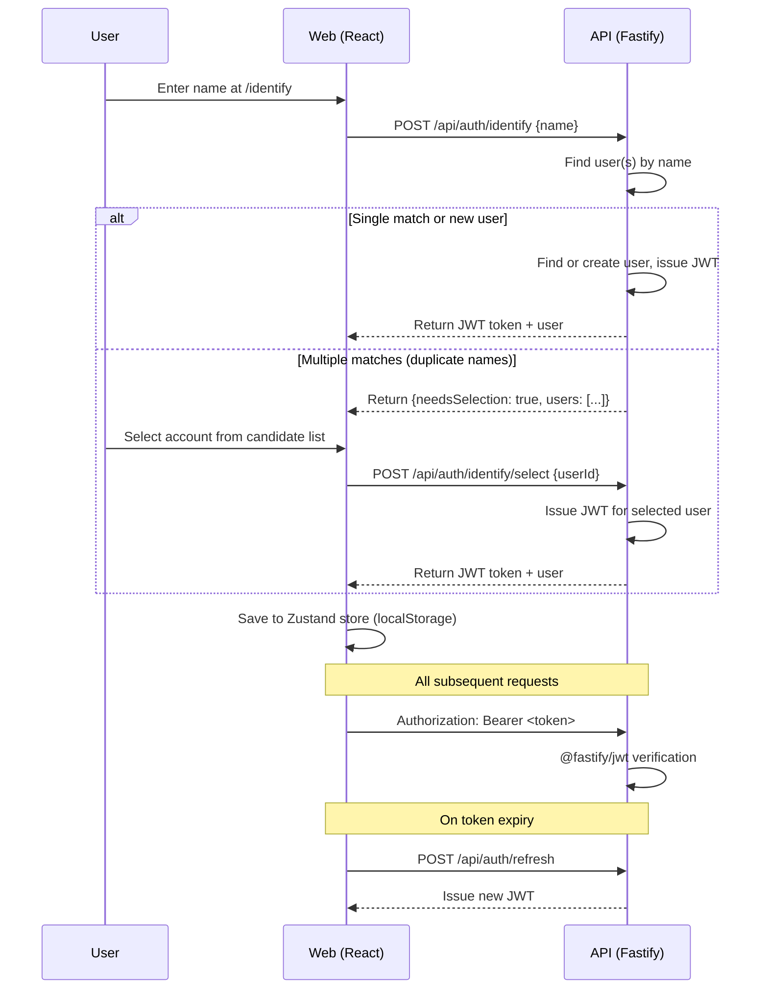
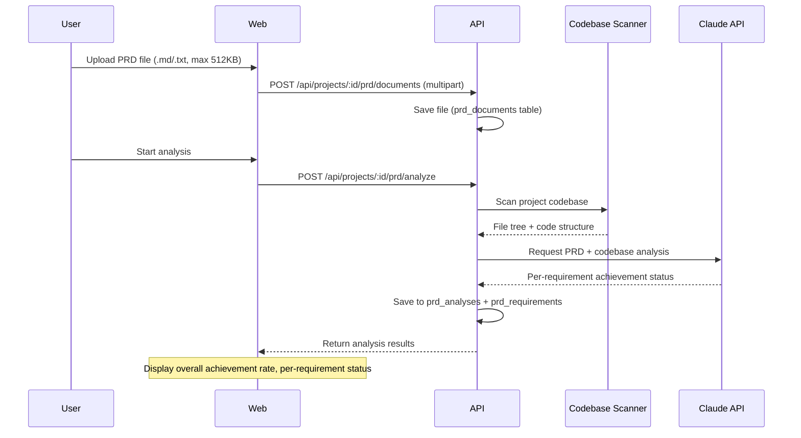

# Architecture

ContextSync system architecture document. An AI development context hub based on a 3-package monorepo.

---

## 1. System Overview

```mermaid
graph TB
    subgraph Client
        Web[React 19 SPA<br/>Vite 6 / React Router 7]
    end

    subgraph Server
        API[Fastify 5 API<br/>:3001]
    end

    subgraph Data
        DB[(PostgreSQL 16<br/>Kysely 0.27)]
    end

    subgraph External
        Claude[Anthropic API<br/>Claude]
    end

    subgraph Shared
        PKG[@context-sync/shared<br/>Types, Constants, Validators]
    end

    Web -->|REST /api| API
    API --> DB
    API --> Claude
    Web -.->|import| PKG
    API -.->|import| PKG
```

---

## 2. Monorepo Structure

### pnpm Workspaces

```yaml
packages:
  - 'packages/*' # shared
  - 'apps/*' # api, web
```

### Turborepo Build Pipeline

| Task        | Dependencies | Output    | Caching         |
| ----------- | ------------ | --------- | --------------- |
| `build`     | `^build`     | `dist/**` | Yes             |
| `dev`       | —            | —         | No (persistent) |
| `lint`      | `^build`     | —         | Yes             |
| `typecheck` | `^build`     | —         | Yes             |
| `test`      | `^build`     | —         | Yes             |

`^build`: the shared package builds first, then apps build.

### Package Dependency Graph

```
apps/api  ──→ packages/shared
apps/web  ──→ packages/shared
```

---

## 3. Backend Architecture

### Server Bootstrap (`apps/api/src/app.ts`)

Plugin registration order:

1. **CORS** — restricted to `FRONTEND_URL` origin
2. **Error Handler** — global error → `fail()` response conversion
3. **JWT Auth** — `@fastify/jwt` token verification
4. **Multipart** — file uploads (10MB limit)

Module route registration order:

1. Auth → `/api/auth`
2. Projects → `/api`
3. Sessions → `/api`
4. Conflicts → `/api`
5. Search → `/api`
6. Notifications → `/api`
7. PRD Analysis → `/api`
8. Activity → `/api`
9. Plans → `/api`
10. AI Evaluation → `/api`
11. Admin → `/api`
12. Supabase Onboarding → `/api`
13. Setup → `/api`
14. Local Sessions → `/api`
15. Quota → `/api`

`localDb` (Kysely), `remoteDb` (Kysely | null), `resolveDb` (async projectId → Db), and `env` (Env) objects are decorated onto the FastifyInstance. `resolveDb` dynamically routes to `localDb` or `remoteDb` based on the project's `database_mode`.

### Module Pattern (4-file structure)

```
modules/<feature>/
  <feature>.routes.ts       # FastifyPluginAsync, route handlers
  <feature>.service.ts      # Business logic (pure functions)
  <feature>.repository.ts   # Kysely data access
  <feature>.schema.ts       # Zod input validation
  __tests__/
```

**Request flow:**

```
Client → Routes (Zod validation) → Service (authorization) → Repository (Kysely query) → DB
                                                                                         ↓
Client ← Routes (ok/fail)        ← Service (domain logic)  ← Repository (object mapping) ← DB
```

### 15 Modules

| Module                | Route Prefix                      | Purpose                                                             |
| --------------------- | --------------------------------- | ------------------------------------------------------------------- |
| `auth`                | `/api/auth`                       | Name-based identity, JWT issuance/refresh                           |
| `projects`            | `/api/projects`                   | Project CRUD, collaborator management                               |
| `sessions`            | `/api/projects/:id/sessions`      | Session management, import/export, local sync, token usage          |
| `conflicts`           | `/api/projects/:id/conflicts`     | Conflict detection, status management (detected→reviewing→resolved) |
| `search`              | `/api/projects/:id/search`        | PostgreSQL tsvector full-text search                                |
| `notifications`       | `/api/projects/:id/notifications` | Email/Slack notifications                                           |
| `prd-analysis`        | `/api/projects/:id/prd`           | PRD upload, Claude API analysis, requirement tracking               |
| `activity`            | `/api/projects/:id/activity`      | Project activity log (session/conflict/collaboration events)        |
| `plans`               | `/api/projects/:id/plans`         | Plan management (CRUD)                                              |
| `ai-evaluation`       | `/api/projects/:id/ai-evaluation` | AI utilization evaluation (per-user proficiency analysis)           |
| `admin`               | `/api/admin`                      | DB health, migrations, project settings                             |
| `supabase-onboarding` | `/api/supabase-onboarding`        | Supabase onboarding flow (project creation, guided setup)           |
| `setup`               | `/api/setup`                      | Database connection status, remote DB test/switch, migration run    |
| `local-sessions`      | `/api/sessions/local`             | Local session scanning & sync                                       |
| `quota`               | `/api/quota`                      | Rate limit capture & quota tracking                                 |

### Service Conventions

Export pure functions, not classes. First argument is `db: Db` (dependency injection):

```typescript
export async function createProject(
  db: Db,
  userId: string,
  input: CreateProjectInput,
): Promise<Project>;
```

### API Response Envelope

```typescript
interface ApiResponse<T> {
  readonly success: boolean;
  readonly data: T | null;
  readonly error: string | null;
  readonly meta?: PaginationMeta;
}

interface PaginationMeta {
  readonly total: number;
  readonly page: number;
  readonly limit: number;
  readonly totalPages: number;
}
```

Helper functions (`apps/api/src/lib/api-response.ts`):

- `ok<T>(data)` → `{ success: true, data, error: null }`
- `fail(error)` → `{ success: false, data: null, error }`
- `paginated<T>(data, meta)` → includes pagination meta
- `buildPaginationMeta(total, page, limit)` → auto-calculates totalPages

### Error Handling

```
AppError(message, statusCode)      ← base class (default 400)
  ├── NotFoundError(resource)      ← 404
  ├── UnauthorizedError(message)   ← 401
  └── ForbiddenError(message)      ← 403
```

Global error handler converts all errors to `fail()` responses. Only 5xx errors are logged server-side.

---

## 4. Database Design

### PostgreSQL 16 + Kysely 0.27

- Pool: max 20 connections, 30s idle timeout, 5s connect timeout
- Types: `Db = Kysely<Database>` (`apps/api/src/database/types.ts`)

### Tables (16)

| Table                      | Purpose                      | Key Columns                                                                |
| -------------------------- | ---------------------------- | -------------------------------------------------------------------------- |
| `users`                    | User profiles                | github_id (nullable), email, name, avatar_url, is_auto, claude_plan        |
| `projects`                 | Project metadata             | owner_id, name, description, repo_url, local_directory, database_mode      |
| `project_collaborators`    | Role-based access            | project_id, user_id, role (owner/member), local_directory                  |
| `sessions`                 | Claude Code sessions         | title, source, status, file_paths[], module_names[], tags[], search_vector |
| `messages`                 | Session messages             | role, content, content_type, tokens_used, model_used, search_vector        |
| `conflicts`                | Detected conflicts           | conflict_type, severity, status, overlapping_paths[], reviewer_id          |
| `prompt_templates`         | Reusable prompts             | category, tags[], usage_count, version                                     |
| `synced_sessions`          | External session tracking    | external_session_id, source_path                                           |
| `prd_documents`            | PRD document uploads         | title, content, file_name                                                  |
| `prd_analyses`             | PRD analysis results         | status, overall_rate, model_used, token usage                              |
| `prd_requirements`         | Individual requirements      | category, status, confidence, evidence, file_paths[]                       |
| `activity_log`             | Project activity log         | project_id, user_id, action, entity_type, entity_id, metadata              |
| `ai_evaluations`           | AI utilization evaluations   | project_id, target_user_id, overall_score, proficiency_tier                |
| `ai_evaluation_dimensions` | Evaluation dimensions        | evaluation_id, dimension, score, confidence, strengths[], weaknesses[]     |
| `ai_evaluation_evidence`   | Evaluation evidence          | dimension_id, message_id, session_id, excerpt, sentiment                   |
| `rate_limit_snapshots`     | Rate limit snapshot tracking | user_id, project_id, plan_tier, usage_percent, captured_at                 |

### Full-Text Search

- `sessions.search_vector` (tsvector) — session title, tag search
- `messages.search_vector` (tsvector) — message content search
- PostgreSQL FTS with `plainto_tsquery`

### Migrations (27)

`apps/api/src/database/migrations/`

| #   | File                               | Description                                 |
| --- | ---------------------------------- | ------------------------------------------- |
| 001 | `create_users`                     | Users table                                 |
| 002 | `create_teams`                     | Teams (deprecated, replaced in 012)         |
| 003 | `create_projects`                  | Projects                                    |
| 004 | `create_sessions`                  | Sessions                                    |
| 005 | `create_messages`                  | Messages                                    |
| 006 | `create_conflicts`                 | Conflicts                                   |
| 007 | `create_prompt_templates`          | Prompt templates                            |
| 008 | `add_search_indexes`               | tsvector full-text search                   |
| 009 | `add_sync_tracking`                | Sync tracking                               |
| 010 | `add_personal_projects`            | Personal projects                           |
| 011 | `add_project_local_directory`      | Local directory field                       |
| 012 | `replace_teams_with_collaborators` | Role-based collaborators                    |
| 013 | `create_prd_analysis`              | PRD analysis tables                         |
| 014 | `create_activity_log`              | Activity log table                          |
| 015 | `add_conflict_reviewer`            | Reviewer fields on conflicts                |
| 016 | `add_collaborator_local_directory` | Local directory for collaborators           |
| 017 | `create_project_invitations`       | Project invitation workflow                 |
| 018 | `create_ai_evaluations`            | AI evaluation tables (3 tables)             |
| 019 | `make_github_id_nullable`          | Allow null github_id for local auth         |
| 020 | `add_is_auto_to_users`             | Auto-user flag                              |
| 021 | `add_claude_plan_to_users`         | Claude plan tier field                      |
| 022 | `create_db_config_tables`          | External DB config + migration jobs         |
| 023 | `add_anthropic_api_key_to_users`   | Per-user Anthropic API key                  |
| 024 | `add_supabase_token_to_users`      | Supabase access token for onboarding        |
| 025 | `simplify_collaboration`           | Remove admin role, simplify to owner/member |
| 026 | `create_rate_limit_snapshots`      | Rate limit snapshot tracking                |
| 027 | `add_project_database_mode`        | Per-project local/remote DB routing         |

---

## 5. Authentication Flow



### Auth Endpoints

| Endpoint                    | Method | Auth | Description                                                         |
| --------------------------- | ------ | ---- | ------------------------------------------------------------------- |
| `/api/auth/identify`        | POST   | No   | Enter name to create or find user. Returns JWT or candidate list.   |
| `/api/auth/identify/select` | POST   | No   | Select a specific user from duplicate-name candidates. Returns JWT. |
| `/api/auth/login`           | POST   | No   | Legacy: login with name + email.                                    |
| `/api/auth/refresh`         | POST   | Yes  | Refresh JWT token.                                                  |
| `/api/auth/me`              | GET    | Yes  | Get current user profile.                                           |
| `/api/setup/status`         | GET    | No   | Database connection status (publicly accessible, no auth required). |

### Key Behaviors

- **AppEntryRedirect** (`/`): Redirects unauthenticated users to `/identify`. Authenticated users go to `/dashboard` or `/onboarding`.
- JWT expiry: `JWT_EXPIRES_IN` (default 7d)
- JWT Secret: minimum 32 characters
- API client automatically attempts one refresh on 401 response

---

## 6. Frontend Architecture

### Build & Development

- **Vite 6** + `@vitejs/plugin-react`
- **Tailwind CSS 4** + `@tailwindcss/vite`
- **Path alias:** `@` → `src/`
- **API proxy:** `/api` → `http://localhost:3001`
- **Dev port:** 5173

### Routing (React Router 7)

```
/                               → AppEntryRedirect (redirects to /identify or /dashboard or /onboarding)
/identify                       → IdentifyPage (name-based identify flow)
/login                          → LoginPage (redirects to /identify)
/onboarding                     → OnboardingPage (redirects to /project on success)
/ (Protected + AppLayout)
  ├── /dashboard                → DashboardPage
  ├── /project                  → ProjectPage (session list, aka Conversations)
  ├── /project/sessions/:id     → SessionDetailPage
  ├── /conflicts                → ConflictsPage
  ├── /prd-analysis             → PrdAnalysisPage
  ├── /ai-evaluation            → AiEvaluationPage
  ├── /plans                    → PlansPage
  ├── /admin                    → AdminPage (team-host mode, owner/admin only)
  ├── /settings                 → SettingsPage (sidebar tab navigation)
  └── /settings?tab=<tab>       → general | team | integrations | danger-zone
```

Protected Route: checks token + onboarding status. Legacy routes (`/sessions`, `/local-sessions`) redirect to `/project`.

### State Management

**Dual state pattern:**

| Layer        | Tool          | Purpose                          | Persistence            |
| ------------ | ------------- | -------------------------------- | ---------------------- |
| Client state | Zustand 5     | Auth, theme, selected project    | localStorage           |
| Server state | React Query 5 | API data fetching, caching, sync | Memory (30s staleTime) |

**Zustand Stores:**

- `useAuthStore` — `token`, `user`, `currentProjectId`, `setAuth()`, `setCurrentProject()`, `logout()`
- `useThemeStore` — `theme`, `toggleTheme()`
- `useUiStore` — `sidebarCollapsed`, `toggleSidebar()`
- `useLocaleStore` — `locale`, `setLocale()` (en/ko/ja)

**React Query Conventions:**

- Query keys: `['resource', id, filter]` (e.g., `['sessions', projectId, { status: 'active' }]`)
- After mutation: `queryClient.invalidateQueries()` to invalidate related cache
- staleTime: 30 seconds, retry: 1 attempt

### API Client (`apps/web/src/api/client.ts`)

```typescript
api.get<T>(path)                 // GET + Authorization header
api.post<T>(path, body?)         // POST (auto-detects JSON or FormData)
api.patch<T>(path, body)         // PATCH
api.put<T>(path, body)           // PUT
api.delete<T>(path)              // DELETE
api.upload<T>(path, file)        // POST FormData (file upload)
```

- Automatically attaches `Authorization: Bearer <token>`
- On 401 response: token refresh → one retry
- Throws error on non-success responses

### Component Organization (Feature-based)

```
components/
  ui/           # Generic UI (Button, Card, Input, Modal, ...)
  auth/         # IdentifyPage, AppEntryRedirect
  layout/       # AppLayout, Header, Sidebar, ProjectSelector, JoinProjectDialog
  projects/     # Project creation/editing
  sessions/     # Session list, detail, import
  conflicts/    # Conflict list, detail
  search/       # Search bar, results
  prd-analysis/ # PRD upload, analysis results, requirements
  dashboard/    # Dashboard widgets, EmptyDashboard
  settings/     # SettingsLayout, GeneralTab, TeamTab, IntegrationsTab, DangerZoneTab
```

---

## 7. Shared Package (`packages/shared`)

Imported as `@context-sync/shared` by both API and Web.

### Types (15 files)

| File                     | Key Types                                                                      |
| ------------------------ | ------------------------------------------------------------------------------ |
| `api.ts`                 | `ApiResponse<T>`, `PaginationMeta`, `PaginationQuery`                          |
| `user.ts`                | `User`, `UserRole`, `NotificationSettings`                                     |
| `project.ts`             | `Project`, `CreateProjectInput`, `UpdateProjectInput`                          |
| `session.ts`             | `Session`, `Message`, `SessionWithMessages`, `DashboardStats`, `TimelineEntry` |
| `conflict.ts`            | `Conflict`, `ConflictType`, `ConflictSeverity`, `ConflictStatus`               |
| `prd-analysis.ts`        | `PrdDocument`, `PrdAnalysis`, `PrdRequirement`, `PrdAnalysisWithRequirements`  |
| `token-usage.ts`         | `ModelUsageBreakdown`, `TokenUsageStats`, `DailyTokenUsage`                    |
| `collaborator.ts`        | `Collaborator`, `AddCollaboratorInput`                                         |
| `sync.ts`                | Sync-related types                                                             |
| `admin.ts`               | `AdminStatus`, `AdminConfig`, `MigrationInfo`, `MigrationRunResult`            |
| `activity.ts`            | `ActivityLog`, `ActivityAction`, `ActivityEntityType`                          |
| `ai-evaluation.ts`       | `AiEvaluation`, `EvaluationDimension`, `EvaluationEvidence`                    |
| `db-config.ts`           | `ProjectDbConfig`, `DataMigrationJob`                                          |
| `plan.ts`                | `Plan`, plan-related types                                                     |
| `supabase-onboarding.ts` | Supabase onboarding flow types                                                 |

### Constants (9 files)

| File                       | Contents                                        |
| -------------------------- | ----------------------------------------------- |
| `roles.ts`                 | `USER_ROLES = ['owner', 'member']`              |
| `session-status.ts`        | Session status enumerations                     |
| `conflict-severity.ts`     | Conflict severity enumerations                  |
| `model-pricing.ts`         | Per-model token pricing                         |
| `prd-analysis.ts`          | `SUPPORTED_PRD_EXTENSIONS`, `MAX_PRD_FILE_SIZE` |
| `ai-evaluation.ts`         | Evaluation dimensions, proficiency tiers        |
| `anthropic-models.ts`      | Anthropic model definitions and metadata        |
| `claude-plan.ts`           | Claude plan tiers (free, pro, team, enterprise) |
| `rate-limit-thresholds.ts` | Rate limit thresholds per Claude plan tier      |

### Validators (2 files)

- `session.validator.ts` — Session input Zod schema
- `project.validator.ts` — Project input Zod schema

---

## 8. PRD Analysis Feature

### Flow



### Analysis Result Structure

- **Overall achievement rate:** 0~100%
- **Per requirement:** `achieved` | `partial` | `not_started`
- **Each requirement:** category, confidence, evidence, file_paths[]
- **Token usage:** per-model input/output token tracking

---

## 9. Environment Variables

Managed in `apps/api/.env`, validated at startup by `config/env.ts` using Zod.

### Required

| Variable       | Description               |
| -------------- | ------------------------- |
| `DATABASE_URL` | PostgreSQL connection URL |

### Optional (with defaults)

| Variable                 | Default                    | Description                                            |
| ------------------------ | -------------------------- | ------------------------------------------------------ |
| `JWT_SECRET`             | (dev default built-in)     | JWT signing key (min 32 chars, override in production) |
| `PORT`                   | `3001`                     | API server port                                        |
| `HOST`                   | `0.0.0.0`                  | Bind host                                              |
| `NODE_ENV`               | `development`              | Environment                                            |
| `JWT_EXPIRES_IN`         | `7d`                       | Token expiry                                           |
| `FRONTEND_URL`           | `http://localhost:5173`    | CORS origin                                            |
| `ANTHROPIC_API_KEY`      | —                          | Claude API key for PRD analysis                        |
| `ANTHROPIC_MODEL`        | `claude-sonnet-4-20250514` | Analysis model                                         |
| `SLACK_WEBHOOK_URL`      | —                          | Slack notifications                                    |
| `DATABASE_SSL`           | `false`                    | Enable SSL for PostgreSQL connection                   |
| `DATABASE_SSL_CA`        | —                          | Path to CA certificate for SSL verification            |
| `RUN_MIGRATIONS`         | `true`                     | Auto-run migrations (`false` for team-member)          |
| `REMOTE_DATABASE_URL`    | —                          | Remote PostgreSQL for dual-pool routing                |
| `REMOTE_DATABASE_SSL`    | `false`                    | SSL for remote DB connection                           |
| `REMOTE_DATABASE_SSL_CA` | —                          | CA certificate for remote DB SSL                       |

---

## 10. Deployment & CI

### Docker Compose

```yaml
services:
  postgres:
    image: postgres:16-alpine
    port: 5432
    healthcheck: pg_isready (5s interval)
    volume: pgdata (persistent)

  postgres-team:                    # profile: team-host
    image: postgres:16-alpine
    SSL enabled, team roles
    volume: pgdata-team (persistent)
```

### Deployment Modes

| Mode          | Docker? | DB             | Migrations | SSL |
| ------------- | ------- | -------------- | ---------- | --- |
| `personal`    | Yes     | Local          | Auto       | Off |
| `team-host`   | Yes     | Local + Remote | Auto       | On  |
| `team-member` | No      | Remote         | Disabled   | On  |

- **Personal:** Default mode. Local Docker PostgreSQL, zero config.
- **Team Host:** Admin runs `docker compose --profile team-host`. Dual DB pool routes per-project via `database_mode`.
- **Team Member:** Developer joins via `pnpm setup:team`. No Docker needed.

### Self-Hosted PostgreSQL Setup Flow

The frontend provides a Self-Hosted PostgreSQL option alongside Supabase in Settings > Integrations > Remote Database:

1. User selects "Self-Hosted PostgreSQL" tab in the provider selector
2. Enters `postgresql://...` connection URL + toggles SSL
3. Clicks "Test Connection" → `POST /setup/test-connection` → returns latency/version
4. Clicks "Connect" → `POST /setup/switch-to-remote` → runs migrations on remote DB, updates `.env`
5. User restarts API server to apply the new `DATABASE_URL`

**Backend endpoints** (no changes needed — `setup` module already supports this):

- `GET /setup/status` — Returns `{ databaseMode, provider, host }`
- `POST /setup/test-connection` — Tests arbitrary PostgreSQL URL
- `POST /setup/switch-to-remote` — Migrates + updates `.env`

Run `bash scripts/setup.sh` for an interactive setup wizard that configures the correct mode.

### GitHub Actions CI (`.github/workflows/ci.yml`)

**Trigger:** main push, main PR

**Pipeline:**

1. Checkout → pnpm bootstrap (v4) → Node 22 + cache
2. `pnpm install --frozen-lockfile`
3. Build shared package
4. `pnpm typecheck`
5. `pnpm test` (Vitest)
