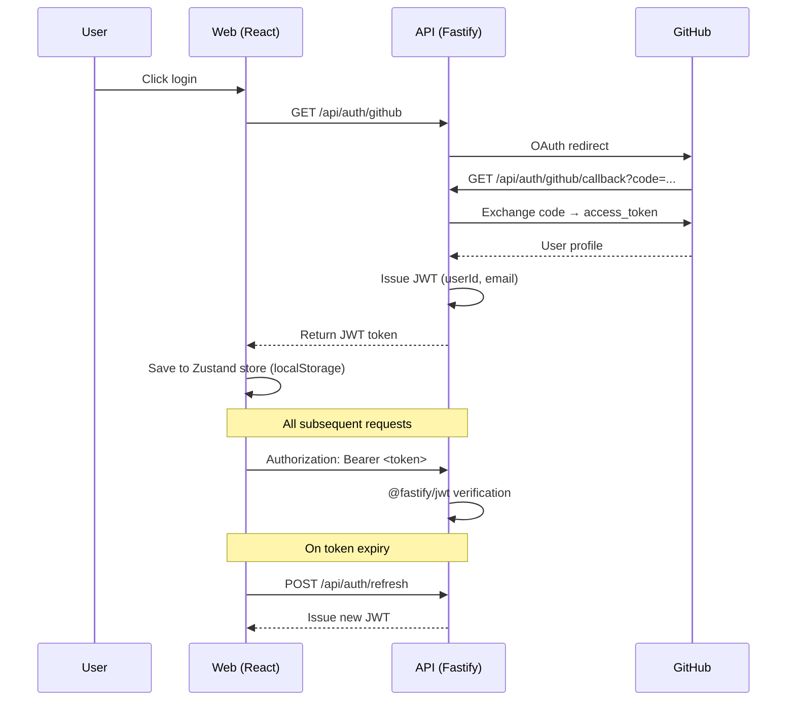
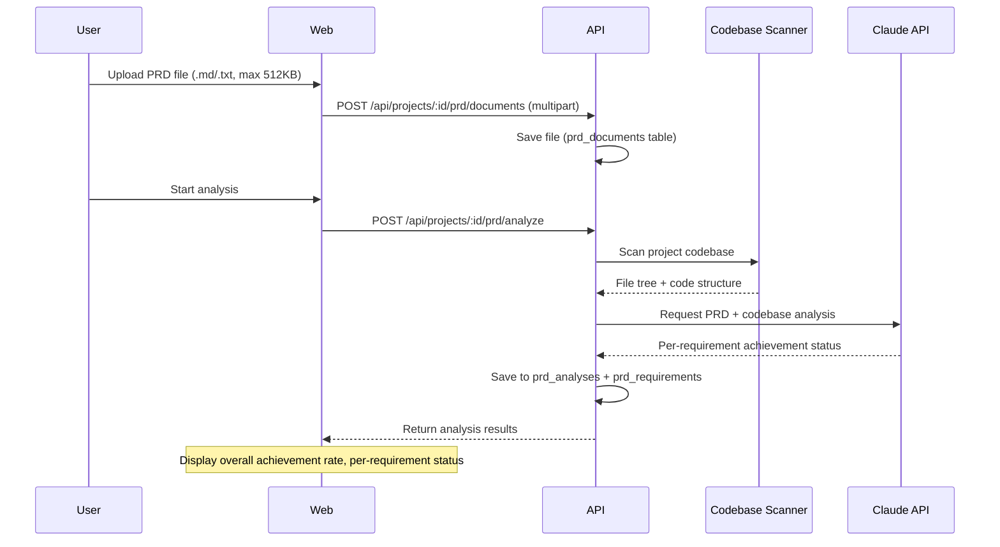

# Architecture

ContextSync system architecture document. A session context management platform based on a 3-package monorepo.

---

## 1. System Overview

```mermaid
graph TB
    subgraph Client
        Web[React 19 SPA<br/>Vite 6 / React Router 7]
    end

    subgraph Server
        API[Fastify 5 API<br/>:3001]
    end

    subgraph Data
        DB[(PostgreSQL 16<br/>Kysely 0.27)]
    end

    subgraph External
        GH[GitHub OAuth]
        Claude[Anthropic API<br/>Claude]
    end

    subgraph Shared
        PKG[@context-sync/shared<br/>Types, Constants, Validators]
    end

    Web -->|REST /api| API
    API --> DB
    API --> GH
    API --> Claude
    Web -.->|import| PKG
    API -.->|import| PKG
```

---

## 2. Monorepo Structure

### pnpm Workspaces

```yaml
packages:
  - 'packages/*' # shared
  - 'apps/*' # api, web
```

### Turborepo Build Pipeline

| Task        | Dependencies | Output    | Caching         |
| ----------- | ------------ | --------- | --------------- |
| `build`     | `^build`     | `dist/**` | Yes             |
| `dev`       | —            | —         | No (persistent) |
| `lint`      | `^build`     | —         | Yes             |
| `typecheck` | `^build`     | —         | Yes             |
| `test`      | `^build`     | —         | Yes             |

`^build`: the shared package builds first, then apps build.

### Package Dependency Graph

```
apps/api  ──→ packages/shared
apps/web  ──→ packages/shared
```

---

## 3. Backend Architecture

### Server Bootstrap (`apps/api/src/app.ts`)

Plugin registration order:

1. **CORS** — restricted to `FRONTEND_URL` origin
2. **Error Handler** — global error → `fail()` response conversion
3. **JWT Auth** — `@fastify/jwt` token verification
4. **Multipart** — file uploads (10MB limit)

Module route registration order:

1. Auth → `/api/auth`
2. Projects → `/api`
3. Sessions → `/api`
4. Conflicts → `/api`
5. Search → `/api`
6. Notifications → `/api`
7. PRD Analysis → `/api`

`db` (Kysely) and `env` (Env) objects are decorated onto the FastifyInstance.

### Module Pattern (4-file structure)

```
modules/<feature>/
  <feature>.routes.ts       # FastifyPluginAsync, route handlers
  <feature>.service.ts      # Business logic (pure functions)
  <feature>.repository.ts   # Kysely data access
  <feature>.schema.ts       # Zod input validation
  __tests__/
```

**Request flow:**

```
Client → Routes (Zod validation) → Service (authorization) → Repository (Kysely query) → DB
                                                                                         ↓
Client ← Routes (ok/fail)        ← Service (domain logic)  ← Repository (object mapping) ← DB
```

### 10 Modules

| Module          | Route Prefix                                        | Purpose                                                             |
| --------------- | --------------------------------------------------- | ------------------------------------------------------------------- |
| `auth`          | `/api/auth`                                         | GitHub OAuth, JWT issuance/refresh                                  |
| `projects`      | `/api/projects`                                     | Project CRUD, collaborator management                               |
| `sessions`      | `/api/projects/:id/sessions`                        | Session management, import/export, local sync, token usage          |
| `conflicts`     | `/api/projects/:id/conflicts`                       | Conflict detection, status management (detected→reviewing→resolved) |
| `search`        | `/api/projects/:id/search`                          | PostgreSQL tsvector full-text search                                |
| `notifications` | `/api/projects/:id/notifications`                   | Email/Slack notifications                                           |
| `prd-analysis`  | `/api/projects/:id/prd`                             | PRD upload, Claude API analysis, requirement tracking               |
| `invitations`   | `/api/invitations`, `/api/projects/:id/invitations` | Project invitation with token/link, accept/decline workflow         |
| `users`         | `/api/users`                                        | User profiles                                                       |
| `admin`         | `/api/admin`                                        | DB health, migration management, team config (team-host only)       |

### Service Conventions

Export pure functions, not classes. First argument is `db: Db` (dependency injection):

```typescript
export async function createProject(
  db: Db,
  userId: string,
  input: CreateProjectInput,
): Promise<Project>;
```

### API Response Envelope

```typescript
interface ApiResponse<T> {
  readonly success: boolean;
  readonly data: T | null;
  readonly error: string | null;
  readonly meta?: PaginationMeta;
}

interface PaginationMeta {
  readonly total: number;
  readonly page: number;
  readonly limit: number;
  readonly totalPages: number;
}
```

Helper functions (`apps/api/src/lib/api-response.ts`):

- `ok<T>(data)` → `{ success: true, data, error: null }`
- `fail(error)` → `{ success: false, data: null, error }`
- `paginated<T>(data, meta)` → includes pagination meta
- `buildPaginationMeta(total, page, limit)` → auto-calculates totalPages

### Error Handling

```
AppError(message, statusCode)      ← base class (default 400)
  ├── NotFoundError(resource)      ← 404
  ├── UnauthorizedError(message)   ← 401
  └── ForbiddenError(message)      ← 403
```

Global error handler converts all errors to `fail()` responses. Only 5xx errors are logged server-side.

---

## 4. Database Design

### PostgreSQL 16 + Kysely 0.27

- Pool: max 20 connections, 30s idle timeout, 5s connect timeout
- Types: `Db = Kysely<Database>` (`apps/api/src/database/types.ts`)

### Tables (12)

| Table                   | Purpose                   | Key Columns                                                                |
| ----------------------- | ------------------------- | -------------------------------------------------------------------------- |
| `users`                 | GitHub OAuth profiles     | github_id, email, name, avatar_url                                         |
| `projects`              | Project metadata          | owner_id, name, description, repo_url, local_directory                     |
| `project_collaborators` | Role-based access         | project_id, user_id, role (owner/admin/member)                             |
| `sessions`              | Claude Code sessions      | title, source, status, file_paths[], module_names[], tags[], search_vector |
| `messages`              | Session messages          | role, content, content_type, tokens_used, model_used, search_vector        |
| `conflicts`             | Detected conflicts        | conflict_type, severity, status, overlapping_paths[], diff_data            |
| `prompt_templates`      | Reusable prompts          | category, tags[], usage_count, version                                     |
| `synced_sessions`       | External session tracking | external_session_id, source_path                                           |
| `prd_documents`         | PRD document uploads      | title, content, file_name                                                  |
| `prd_analyses`          | PRD analysis results      | status, overall_rate, achievement analysis                                 |
| `prd_requirements`      | Individual requirements   | category, status, confidence, evidence, file_paths[]                       |
| `project_invitations`   | Invitation token/workflow | project_id, inviter_id, email, token, role, status, expires_at             |

### Full-Text Search

- `sessions.search_vector` (tsvector) — session title, tag search
- `messages.search_vector` (tsvector) — message content search
- PostgreSQL FTS with `plainto_tsquery`

### Migrations (13)

`apps/api/src/database/migrations/`

| #   | File                               | Description                         |
| --- | ---------------------------------- | ----------------------------------- |
| 001 | `create_users`                     | Users table                         |
| 002 | `create_teams`                     | Teams (deprecated, replaced in 012) |
| 003 | `create_projects`                  | Projects                            |
| 004 | `create_sessions`                  | Sessions                            |
| 005 | `create_messages`                  | Messages                            |
| 006 | `create_conflicts`                 | Conflicts                           |
| 007 | `create_prompt_templates`          | Prompt templates                    |
| 008 | `add_search_indexes`               | tsvector full-text search           |
| 009 | `add_sync_tracking`                | Sync tracking                       |
| 010 | `add_personal_projects`            | Personal projects                   |
| 011 | `add_project_local_directory`      | Local directory field               |
| 012 | `replace_teams_with_collaborators` | Role-based collaborators            |
| 013 | `create_prd_analysis`              | PRD analysis tables                 |

---

## 5. Authentication Flow



- JWT expiry: `JWT_EXPIRES_IN` (default 7d)
- JWT Secret: minimum 32 characters
- API client automatically attempts one refresh on 401 response

---

## 6. Frontend Architecture

### Build & Development

- **Vite 6** + `@vitejs/plugin-react`
- **Tailwind CSS 4** + `@tailwindcss/vite`
- **Path alias:** `@` → `src/`
- **API proxy:** `/api` → `http://localhost:3001`
- **Dev port:** 5173

### Routing (React Router 7)

```
/login                          → LoginPage
/docs                           → DocsPage (public)
/auth/callback                  → OAuth callback
/onboarding                     → OnboardingPage
/invitations/accept?token=...   → InvitationAcceptPage (public, stores token for post-login)
/invitations/expired            → InvitationExpiredPage (public)
/ (Protected + AppLayout)
  ├── /dashboard                → DashboardPage
  ├── /project                  → ProjectPage (session list)
  ├── /project/sessions/:id     → SessionDetailPage
  ├── /conflicts                → ConflictsPage
  ├── /prd-analysis             → PrdAnalysisPage
  ├── /plans                    → PlansPage
  ├── /admin                    → AdminPage (team-host mode, owner/admin only)
  └── /settings                 → SettingsPage
```

Protected Route: checks token + onboarding status.

### State Management

**Dual state pattern:**

| Layer        | Tool          | Purpose                          | Persistence            |
| ------------ | ------------- | -------------------------------- | ---------------------- |
| Client state | Zustand 5     | Auth, theme, selected project    | localStorage           |
| Server state | React Query 5 | API data fetching, caching, sync | Memory (30s staleTime) |

**Zustand Stores:**

- `useAuthStore` — `token`, `user`, `currentProjectId`, `setAuth()`, `setCurrentProject()`, `logout()`
- `useThemeStore` — `theme`, `toggleTheme()`

**React Query Conventions:**

- Query keys: `['resource', id, filter]` (e.g., `['sessions', projectId, { status: 'active' }]`)
- After mutation: `queryClient.invalidateQueries()` to invalidate related cache
- staleTime: 30 seconds, retry: 1 attempt

### API Client (`apps/web/src/api/client.ts`)

```typescript
api.get<T>(path)                 // GET + Authorization header
api.post<T>(path, body?)         // POST (auto-detects JSON or FormData)
api.patch<T>(path, body)         // PATCH
api.put<T>(path, body)           // PUT
api.delete<T>(path)              // DELETE
api.upload<T>(path, file)        // POST FormData (file upload)
```

- Automatically attaches `Authorization: Bearer <token>`
- On 401 response: token refresh → one retry
- Throws error on non-success responses

### Component Organization (Feature-based)

```
components/
  ui/           # Generic UI (Button, Card, Input, Modal, ...)
  auth/         # Login, OAuth callback
  layout/       # AppLayout, Header, Sidebar, ProjectSelector
  projects/     # Project creation/editing
  sessions/     # Session list, detail, import
  conflicts/    # Conflict list, detail
  search/       # Search bar, results
  prd-analysis/ # PRD upload, analysis results, requirements
  dashboard/    # Dashboard widgets
```

---

## 7. Shared Package (`packages/shared`)

Imported as `@context-sync/shared` by both API and Web.

### Types (10 files)

| File              | Key Types                                                                      |
| ----------------- | ------------------------------------------------------------------------------ |
| `api.ts`          | `ApiResponse<T>`, `PaginationMeta`, `PaginationQuery`                          |
| `user.ts`         | `User`, `UserRole`, `NotificationSettings`                                     |
| `project.ts`      | `Project`, `CreateProjectInput`, `UpdateProjectInput`                          |
| `session.ts`      | `Session`, `Message`, `SessionWithMessages`, `DashboardStats`, `TimelineEntry` |
| `conflict.ts`     | `Conflict`, `ConflictType`, `ConflictSeverity`, `ConflictStatus`               |
| `prd-analysis.ts` | `PrdDocument`, `PrdAnalysis`, `PrdRequirement`, `PrdAnalysisWithRequirements`  |
| `token-usage.ts`  | `ModelUsageBreakdown`, `TokenUsageStats`, `DailyTokenUsage`                    |
| `collaborator.ts` | `Collaborator`, `AddCollaboratorInput`                                         |
| `invitation.ts`   | `Invitation`, `InvitationStatus`, `CreateInvitationInput`                      |
| `sync.ts`         | Sync-related types                                                             |
| `admin.ts`        | `AdminStatus`, `AdminConfig`, `MigrationInfo`, `MigrationRunResult`            |

### Constants (6 files)

| File                   | Contents                                        |
| ---------------------- | ----------------------------------------------- |
| `roles.ts`             | `USER_ROLES = ['owner', 'admin', 'member']`     |
| `session-status.ts`    | Session status enumerations                     |
| `conflict-severity.ts` | Conflict severity enumerations                  |
| `model-pricing.ts`     | Per-model token pricing                         |
| `prd-analysis.ts`      | `SUPPORTED_PRD_EXTENSIONS`, `MAX_PRD_FILE_SIZE` |
| `invitation-status.ts` | `INVITATION_STATUSES`, `INVITATION_EXPIRY_DAYS` |

### Validators (2 files)

- `session.validator.ts` — Session input Zod schema
- `project.validator.ts` — Project input Zod schema

---

## 8. PRD Analysis Feature

### Flow



### Analysis Result Structure

- **Overall achievement rate:** 0~100%
- **Per requirement:** `achieved` | `partial` | `not_started`
- **Each requirement:** category, confidence, evidence, file_paths[]
- **Token usage:** per-model input/output token tracking

---

## 9. Environment Variables

Managed in `apps/api/.env`, validated at startup by `config/env.ts` using Zod.

### Required

| Variable               | Description                             |
| ---------------------- | --------------------------------------- |
| `DATABASE_URL`         | PostgreSQL connection URL               |
| `GITHUB_CLIENT_ID`     | GitHub OAuth App ID                     |
| `GITHUB_CLIENT_SECRET` | GitHub OAuth Secret                     |
| `JWT_SECRET`           | JWT signing key (minimum 32 characters) |

### Optional (with defaults)

| Variable            | Default                    | Description                                             |
| ------------------- | -------------------------- | ------------------------------------------------------- |
| `PORT`              | `3001`                     | API server port                                         |
| `HOST`              | `0.0.0.0`                  | Bind host                                               |
| `NODE_ENV`          | `development`              | Environment                                             |
| `JWT_EXPIRES_IN`    | `7d`                       | Token expiry                                            |
| `FRONTEND_URL`      | `http://localhost:5173`    | CORS origin                                             |
| `ANTHROPIC_API_KEY` | —                          | Claude API key for PRD analysis                         |
| `ANTHROPIC_MODEL`   | `claude-sonnet-4-20250514` | Analysis model                                          |
| `SLACK_WEBHOOK_URL` | —                          | Slack notifications                                     |
| `RESEND_API_KEY`    | —                          | Email delivery                                          |
| `EMAIL_FROM`        | `noreply@contextsync.dev`  | Sender email                                            |
| `DEPLOYMENT_MODE`   | `personal`                 | Deployment mode: `personal`, `team-host`, `team-member` |
| `DATABASE_SSL`      | `false`                    | Enable SSL for PostgreSQL connection                    |
| `DATABASE_SSL_CA`   | —                          | Path to CA certificate for SSL verification             |
| `RUN_MIGRATIONS`    | `true`                     | Auto-run migrations (`false` for team-member)           |

---

## 10. Deployment & CI

### Docker Compose

```yaml
services:
  postgres:
    image: postgres:16-alpine
    port: 5432
    healthcheck: pg_isready (5s interval)
    volume: pgdata (persistent)

  postgres-team:                    # profile: team-host
    image: postgres:16-alpine
    SSL enabled, team roles
    volume: pgdata-team (persistent)
```

### Deployment Modes

| Mode          | Docker? | DB          | Migrations | SSL |
| ------------- | ------- | ----------- | ---------- | --- |
| `personal`    | Yes     | Local       | Auto       | Off |
| `team-host`   | Yes     | Local + SSL | Auto       | On  |
| `team-member` | No      | Remote      | Disabled   | On  |

- **Personal:** Default mode. Local Docker PostgreSQL, zero config.
- **Team Host:** Admin runs `docker compose --profile team-host` with SSL certs.
- **Team Member:** Point `DATABASE_URL` to the remote DB, set `RUN_MIGRATIONS=false`.

Run `bash scripts/setup.sh` for an interactive setup wizard that configures the correct mode.

### GitHub Actions CI (`.github/workflows/ci.yml`)

**Trigger:** main push, main PR

**Pipeline:**

1. Checkout → pnpm setup (v4) → Node 22 + cache
2. `pnpm install --frozen-lockfile`
3. Build shared package
4. `pnpm typecheck`
5. `pnpm test` (Vitest)
