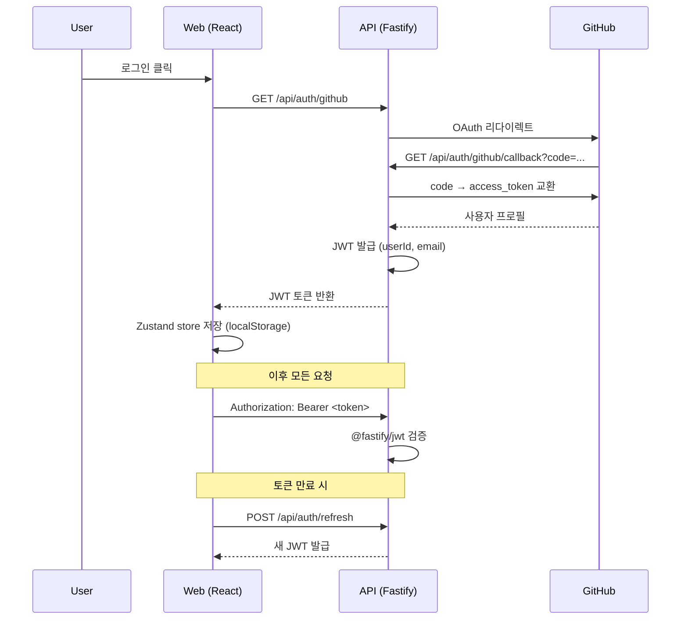
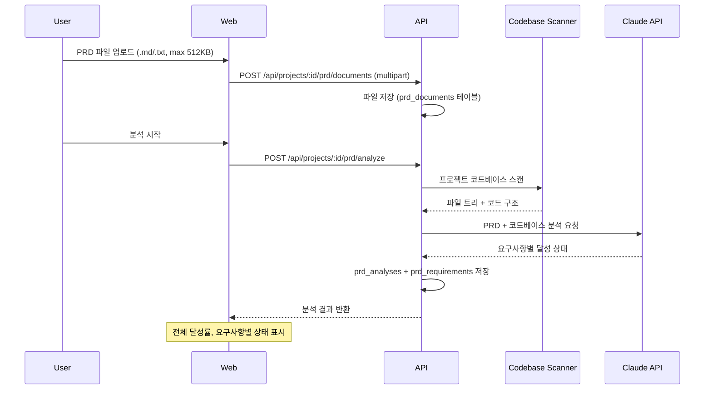

# 아키텍처

ContextSync 시스템 아키텍처 문서. 3-패키지 모노레포 기반의 세션 컨텍스트 관리 플랫폼.

---

## 1. 시스템 개요

```mermaid
graph TB
    subgraph Client
        Web[React 19 SPA<br/>Vite 6 / React Router 7]
    end

    subgraph Server
        API[Fastify 5 API<br/>:3001]
    end

    subgraph Data
        DB[(PostgreSQL 16<br/>Kysely 0.27)]
    end

    subgraph External
        GH[GitHub OAuth]
        Claude[Anthropic API<br/>Claude]
    end

    subgraph Shared
        PKG[@context-sync/shared<br/>Types, Constants, Validators]
    end

    Web -->|REST /api| API
    API --> DB
    API --> GH
    API --> Claude
    Web -.->|import| PKG
    API -.->|import| PKG
```

---

## 2. 모노레포 구조

### pnpm Workspaces

```yaml
packages:
  - "packages/*"    # shared
  - "apps/*"        # api, web
```

### Turborepo 빌드 파이프라인

| 태스크 | 의존성 | 출력 | 캐싱 |
|--------|--------|------|------|
| `build` | `^build` | `dist/**` | O |
| `dev` | — | — | X (persistent) |
| `lint` | `^build` | — | O |
| `typecheck` | `^build` | — | O |
| `test` | `^build` | — | O |

`^build`: shared 패키지가 먼저 빌드된 후 apps 빌드.

### 패키지 의존 관계

```
apps/api  ──→ packages/shared
apps/web  ──→ packages/shared
```

---

## 3. 백엔드 아키텍처

### 서버 부트스트랩 (`apps/api/src/app.ts`)

플러그인 등록 순서:

1. **CORS** — `FRONTEND_URL` origin 제한
2. **Error Handler** — 글로벌 에러 → `fail()` 응답 변환
3. **JWT Auth** — `@fastify/jwt` 토큰 검증
4. **Multipart** — 파일 업로드 (10MB 제한)

모듈 라우트 등록 순서:

1. Auth → `/api/auth`
2. Projects → `/api`
3. Sessions → `/api`
4. Conflicts → `/api`
5. Search → `/api`
6. Notifications → `/api`
7. PRD Analysis → `/api`

`db`(Kysely)와 `env`(Env) 객체가 FastifyInstance에 데코레이트됨.

### 모듈 패턴 (4파일 구조)

```
modules/<feature>/
  <feature>.routes.ts       # FastifyPluginAsync, 라우트 핸들러
  <feature>.service.ts      # 비즈니스 로직 (순수 함수)
  <feature>.repository.ts   # Kysely 데이터 접근
  <feature>.schema.ts       # Zod 입력 검증
  __tests__/
```

**요청 흐름:**

```
Client → Routes (Zod 검증) → Service (권한 검사) → Repository (Kysely 쿼리) → DB
                                                                              ↓
Client ← Routes (ok/fail)  ← Service (도메인 로직) ← Repository (객체 변환) ← DB
```

### 8개 모듈

| 모듈 | 경로 프리픽스 | 역할 |
|------|--------------|------|
| `auth` | `/api/auth` | GitHub OAuth, JWT 발급/리프레시 |
| `projects` | `/api/projects` | 프로젝트 CRUD, 협업자 관리 |
| `sessions` | `/api/projects/:id/sessions` | 세션 관리, 임포트/익스포트, 로컬 동기화, 토큰 사용량 |
| `conflicts` | `/api/projects/:id/conflicts` | 충돌 감지, 상태 관리 (detected→reviewing→resolved) |
| `search` | `/api/projects/:id/search` | PostgreSQL tsvector 전문검색 |
| `notifications` | `/api/projects/:id/notifications` | 이메일/Slack 알림 |
| `prd-analysis` | `/api/projects/:id/prd` | PRD 업로드, Claude API 분석, 요구사항 추적 |
| `users` | `/api/users` | 사용자 프로필 |

### Service 컨벤션

클래스가 아닌 순수 함수 export. 첫 번째 인자로 `db: Db` 전달 (의존성 주입):

```typescript
export async function createProject(
  db: Db,
  userId: string,
  input: CreateProjectInput
): Promise<Project>
```

### API Response Envelope

```typescript
interface ApiResponse<T> {
  readonly success: boolean;
  readonly data: T | null;
  readonly error: string | null;
  readonly meta?: PaginationMeta;
}

interface PaginationMeta {
  readonly total: number;
  readonly page: number;
  readonly limit: number;
  readonly totalPages: number;
}
```

헬퍼 함수 (`apps/api/src/lib/api-response.ts`):

- `ok<T>(data)` → `{ success: true, data, error: null }`
- `fail(error)` → `{ success: false, data: null, error }`
- `paginated<T>(data, meta)` → 페이지네이션 메타 포함
- `buildPaginationMeta(total, page, limit)` → totalPages 자동 계산

### 에러 처리

```
AppError(message, statusCode)      ← 베이스 클래스 (기본 400)
  ├── NotFoundError(resource)      ← 404
  ├── UnauthorizedError(message)   ← 401
  └── ForbiddenError(message)      ← 403
```

글로벌 에러 핸들러가 모든 에러를 `fail()` 응답으로 변환. 5xx 에러만 서버 로깅.

---

## 4. 데이터베이스 설계

### PostgreSQL 16 + Kysely 0.27

- Pool: 최대 20 커넥션, 30s idle timeout, 5s connect timeout
- 타입: `Db = Kysely<Database>` (`apps/api/src/database/types.ts`)

### 테이블 (11개)

| 테이블 | 용도 | 주요 컬럼 |
|--------|------|-----------|
| `users` | GitHub OAuth 프로필 | github_id, email, name, avatar_url |
| `projects` | 프로젝트 메타 | owner_id, name, description, repo_url, local_directory |
| `project_collaborators` | 역할 기반 접근 | project_id, user_id, role (owner/admin/member) |
| `sessions` | Claude Code 세션 | title, source, status, file_paths[], module_names[], tags[], search_vector |
| `messages` | 세션 메시지 | role, content, content_type, tokens_used, model_used, search_vector |
| `conflicts` | 감지된 충돌 | conflict_type, severity, status, overlapping_paths[], diff_data |
| `prompt_templates` | 재사용 프롬프트 | category, tags[], usage_count, version |
| `synced_sessions` | 외부 세션 추적 | external_session_id, source_path |
| `prd_documents` | PRD 문서 업로드 | title, content, file_name |
| `prd_analyses` | PRD 분석 결과 | status, overall_rate, 달성도 분석 |
| `prd_requirements` | 개별 요구사항 | category, status, confidence, evidence, file_paths[] |

### 전문검색

- `sessions.search_vector` (tsvector) — 세션 제목, 태그 검색
- `messages.search_vector` (tsvector) — 메시지 내용 검색
- PostgreSQL FTS로 `plainto_tsquery` 쿼리

### 마이그레이션 (13개)

`apps/api/src/database/migrations/`

| # | 파일 | 내용 |
|---|------|------|
| 001 | `create_users` | 사용자 테이블 |
| 002 | `create_teams` | 팀 (deprecated, 012에서 대체) |
| 003 | `create_projects` | 프로젝트 |
| 004 | `create_sessions` | 세션 |
| 005 | `create_messages` | 메시지 |
| 006 | `create_conflicts` | 충돌 |
| 007 | `create_prompt_templates` | 프롬프트 템플릿 |
| 008 | `add_search_indexes` | tsvector 전문검색 |
| 009 | `add_sync_tracking` | 동기화 추적 |
| 010 | `add_personal_projects` | 개인 프로젝트 |
| 011 | `add_project_local_directory` | 로컬 디렉토리 필드 |
| 012 | `replace_teams_with_collaborators` | 역할 기반 협업자 |
| 013 | `create_prd_analysis` | PRD 분석 테이블 |

---

## 5. 인증 흐름



- JWT 만료: `JWT_EXPIRES_IN` (기본 7d)
- JWT Secret: 최소 32자
- 401 응답 시 API 클라이언트가 자동으로 1회 리프레시 시도

---

## 6. 프론트엔드 아키텍처

### 빌드 & 개발

- **Vite 6** + `@vitejs/plugin-react`
- **Tailwind CSS 4** + `@tailwindcss/vite`
- **Path alias:** `@` → `src/`
- **API proxy:** `/api` → `http://localhost:3001`
- **Dev port:** 5173

### 라우팅 (React Router 7)

```
/login                          → LoginPage
/auth/callback                  → OAuth 콜백
/onboarding                     → OnboardingPage
/ (Protected + AppLayout)
  ├── /dashboard                → DashboardPage
  ├── /project                  → ProjectPage (세션 목록)
  ├── /project/sessions/:id     → SessionDetailPage
  ├── /conflicts                → ConflictsPage
  ├── /prd-analysis             → PrdAnalysisPage
  └── /settings                 → SettingsPage
```

Protected Route: 토큰 확인 + 온보딩 상태 체크.

### 상태 관리

**이중 상태 패턴:**

| 계층 | 도구 | 용도 | 영속 |
|------|------|------|------|
| 클라이언트 상태 | Zustand 5 | 인증, 테마, 선택된 프로젝트 | localStorage |
| 서버 상태 | React Query 5 | API 데이터 페칭, 캐싱, 동기화 | 메모리 (30s staleTime) |

**Zustand Stores:**

- `useAuthStore` — `token`, `user`, `currentProjectId`, `setAuth()`, `setCurrentProject()`, `logout()`
- `useThemeStore` — `theme`, `toggleTheme()`

**React Query 컨벤션:**

- 쿼리 키: `['resource', id, filter]` (예: `['sessions', projectId, { status: 'active' }]`)
- Mutation 후: `queryClient.invalidateQueries()` 로 관련 캐시 무효화
- staleTime: 30초, retry: 1회

### API 클라이언트 (`apps/web/src/api/client.ts`)

```typescript
api.get<T>(path)                 // GET + Authorization header
api.post<T>(path, body?)         // POST (JSON 또는 FormData 자동 판별)
api.patch<T>(path, body)         // PATCH
api.put<T>(path, body)           // PUT
api.delete<T>(path)              // DELETE
api.upload<T>(path, file)        // POST FormData (파일 업로드)
```

- `Authorization: Bearer <token>` 자동 첨부
- 401 응답 시 토큰 리프레시 → 1회 재시도
- 비-success 응답 시 에러 throw

### 컴포넌트 조직 (Feature-based)

```
components/
  ui/           # 범용 UI (Button, Card, Input, Modal, ...)
  auth/         # 로그인, OAuth 콜백
  layout/       # AppLayout, Header, Sidebar, ProjectSelector
  projects/     # 프로젝트 생성/편집
  sessions/     # 세션 목록, 상세, 임포트
  conflicts/    # 충돌 목록, 상세
  search/       # 검색 바, 결과
  prd-analysis/ # PRD 업로드, 분석 결과, 요구사항
  dashboard/    # 대시보드 위젯
```

---

## 7. 공유 패키지 (`packages/shared`)

`@context-sync/shared`로 API/Web 양쪽에서 import.

### Types (9 파일)

| 파일 | 주요 타입 |
|------|-----------|
| `api.ts` | `ApiResponse<T>`, `PaginationMeta`, `PaginationQuery` |
| `user.ts` | `User`, `UserRole`, `NotificationSettings` |
| `project.ts` | `Project`, `CreateProjectInput`, `UpdateProjectInput` |
| `session.ts` | `Session`, `Message`, `SessionWithMessages`, `DashboardStats`, `TimelineEntry` |
| `conflict.ts` | `Conflict`, `ConflictType`, `ConflictSeverity`, `ConflictStatus` |
| `prd-analysis.ts` | `PrdDocument`, `PrdAnalysis`, `PrdRequirement`, `PrdAnalysisWithRequirements` |
| `token-usage.ts` | `ModelUsageBreakdown`, `TokenUsageStats`, `DailyTokenUsage` |
| `collaborator.ts` | `Collaborator`, `AddCollaboratorInput` |
| `sync.ts` | 동기화 관련 타입 |

### Constants (5 파일)

| 파일 | 내용 |
|------|------|
| `roles.ts` | `USER_ROLES = ['owner', 'admin', 'member']` |
| `session-status.ts` | 세션 상태 열거 |
| `conflict-severity.ts` | 충돌 심각도 열거 |
| `model-pricing.ts` | 모델별 토큰 단가 |
| `prd-analysis.ts` | `SUPPORTED_PRD_EXTENSIONS`, `MAX_PRD_FILE_SIZE` |

### Validators (2 파일)

- `session.validator.ts` — 세션 입력 Zod 스키마
- `project.validator.ts` — 프로젝트 입력 Zod 스키마

---

## 8. PRD 분석 기능

### 흐름



### 분석 결과 구조

- **전체 달성률:** 0~100%
- **요구사항별:** `achieved` | `partial` | `not_started`
- **각 요구사항:** category, confidence, evidence, file_paths[]
- **토큰 사용량:** 모델별 input/output 토큰 추적

---

## 9. 환경 변수

`apps/api/.env`에서 관리, `config/env.ts`가 Zod로 시작 시 검증.

### 필수

| 변수 | 설명 |
|------|------|
| `DATABASE_URL` | PostgreSQL 연결 URL |
| `GITHUB_CLIENT_ID` | GitHub OAuth App ID |
| `GITHUB_CLIENT_SECRET` | GitHub OAuth Secret |
| `JWT_SECRET` | JWT 서명 키 (최소 32자) |

### 선택 (기본값 있음)

| 변수 | 기본값 | 설명 |
|------|--------|------|
| `PORT` | `3001` | API 서버 포트 |
| `HOST` | `0.0.0.0` | 바인드 호스트 |
| `NODE_ENV` | `development` | 환경 |
| `JWT_EXPIRES_IN` | `7d` | 토큰 만료 |
| `FRONTEND_URL` | `http://localhost:5173` | CORS origin |
| `ANTHROPIC_API_KEY` | — | PRD 분석용 Claude API 키 |
| `ANTHROPIC_MODEL` | `claude-sonnet-4-20250514` | 분석 모델 |
| `SLACK_WEBHOOK_URL` | — | Slack 알림 |
| `RESEND_API_KEY` | — | 이메일 발송 |
| `EMAIL_FROM` | `noreply@contextsync.dev` | 발신 이메일 |

---

## 10. 배포 & CI

### Docker Compose

```yaml
services:
  postgres:
    image: postgres:16-alpine
    port: 5432
    healthcheck: pg_isready (5s interval)
    volume: pgdata (persistent)
```

### GitHub Actions CI (`.github/workflows/ci.yml`)

**트리거:** main push, main PR

**파이프라인:**
1. Checkout → pnpm setup (v4) → Node 22 + cache
2. `pnpm install --frozen-lockfile`
3. shared 패키지 빌드
4. `pnpm typecheck`
5. `pnpm test` (Vitest)
